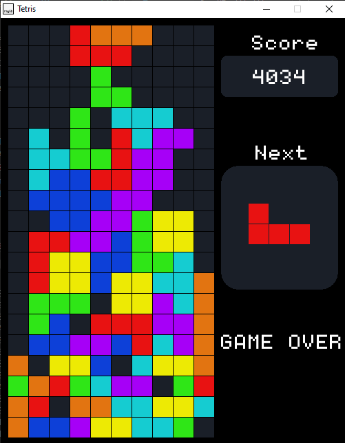

# Tetris Game

Tetris is a classic puzzle game where players arrange falling blocks called tetrominoes to complete horizontal lines. The objective is to clear as many lines as possible to score points.

## Overview

This Tetris game implementation is written in C++ using the Raylib library. The game follows the basic rules of Tetris:
- Tetrominoes fall from the top of the game board.
- Players can move and rotate tetrominoes to fit them into the game board.
- Completing horizontal lines clears them from the board and awards points.
- The game ends when tetrominoes reach the top of the game board.

## Features

- Classic Tetris gameplay: Arrange falling tetrominoes to clear lines and score points.
- Simple controls: Use arrow keys (Left, Right, Down) to move tetrominoes, and the Up key to rotate them.
- Scoring system: Score points for each line cleared and additional points based on the number of lines cleared simultaneously.
- Game Over: When the game ends, a message will be shown indicating that the game is over. Press any key to restart the game.

## Installation

1. Clone or download the Tetris game repository from GitHub.
2. Ensure you have the necessary dependencies installed, including Raylib.
3. Compile the source code using your preferred C++ compiler.
4. Run the executable file to start playing the game.

## Gameplay

1. Start the game by running the executable.
2. Use the arrow keys to move tetrominoes left, right, or down, and use the Up key to rotate them.
3. Arrange tetrominoes to complete horizontal lines and clear them from the game board.
4. Score points for each line cleared according to the scoring system.
5. The game ends when tetrominoes reach the top of the game board.
6. Press any key to restart the game after it ends.

## Scoring System

The scoring system is as follows:
- Single line clear: 100 points
- Double line clear: 300 points
- Triple or more line clear: 500 points per line
- Additional points for each move downwards

## Future Enhancements

- Implement additional game modes or variations.
- Add high score tracking and display.
- Enhance graphics and animations for a more immersive experience.
- Implement sound effects and background music.

## Credits

- Built using [Raylib](https://www.raylib.com/)
- Inspired by the classic Tetris game
